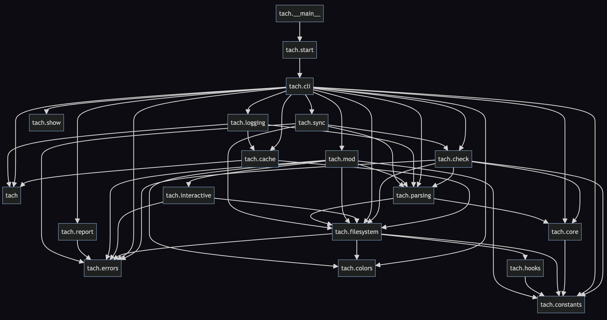

### Installation
```bash
pip install tach
```
### Setup
Tach allows you to configure where you want to place module boundaries in your project.

You can do this interactively! Run:
```bash
 tach mod
# Up/Down: Navigate  Enter: Mark/unmark module  Right: Expand  Left: Collapse  Ctrl + Up: Jump to parent
# Ctrl + s: Exit and save  Ctrl + c: Exit without saving  Ctrl + a: Mark/unmark all
```
Mark and unmark each module boundary you want to create with 'Enter'. You can mark all of your top-level Python source packages, or just a few which you want to isolate.

If your Python code lives below your project root, mark your Python [source root](https://gauge-sh.github.io/tach/configuration#source-root) using the 's' key.

This will create the config file for your project, `tach.yml`.

Once you've marked all the modules you want to enforce constraints between, run:
```bash
tach sync
```
Dependencies that exist between each module you've marked will be written to `tach.yml`.

Check out what Tach has found! 
```
cat tach.yml
```

NOTE: Your 'project root' directory (where `tach.yml` is) will be treated as a module boundary, and can show up as `<root>`.

### Enforcement
Tach comes with a cli command to enforce the boundaries that you just set up! From the root of your Python project, run:
```bash
tach check
```
You will see:
```bash
✅ All module dependencies validated!
```

You can validate that Tach is working by either:
1. Commenting out an item in a `depends_on` key in `tach.yml`
2. By adding an import between modules that didn't previously import from each other. 

Give both a try and run `tach check` again. This will generate an error:
```bash
❌ tach/check.py[L8]: Cannot import 'tach.filesystem'. Tag 'tach' cannot depend on 'tach.filesystem'. 
```

Each error indicates an import which violates your dependencies. If your terminal supports hyperlinks, click on the file path to go directly to the error.

`tach check` will also return an error code, and can be easily integrated with CI/CD, [Pre-commit hooks](https://gauge-sh.github.io/tach/usage/#tach-install), and [VS Code](https://marketplace.visualstudio.com/items?itemName=Gauge.tach), and more!  

### Extras

Visualize your dependency graph! 
```bash
tach show
```
Tach will generate a graph of your dependencies. Here's what this looks like for Tach:




Note that this graph is generated remotely using your `tach.yml` contents.

You can view the dependencies and usages for a given path:
```bash
tach report my_package/
# OR
tach report my_module.py
```
e.g.:
```bash
> tach report python/tach/filesystem
[Dependencies of 'python/tach/filesystem']
python/tach/filesystem/install.py[L6]: Import 'tach.hooks.build_pre_commit_hook_content'
python/tach/filesystem/project.py[L5]: Import 'tach.constants.CONFIG_FILE_NAME'
...
-------------------------------
[Usages of 'python/tach/filesystem']
python/tach/cache/access.py[L8]: Import 'tach.filesystem.find_project_config_root'
python/tach/cache/setup.py[L7]: Import 'tach.filesystem.find_project_config_root'
...
```

Tach also supports:
- [Manual file configuration](https://gauge-sh.github.io/tach/configuration/)
- [Strict public interfaces for modules](https://gauge-sh.github.io/tach/strict-mode/)
- [Inline exceptions](https://gauge-sh.github.io/tach/tach-ignore/)
- [Pre-commit hooks](https://gauge-sh.github.io/tach/usage/#tach-install)
